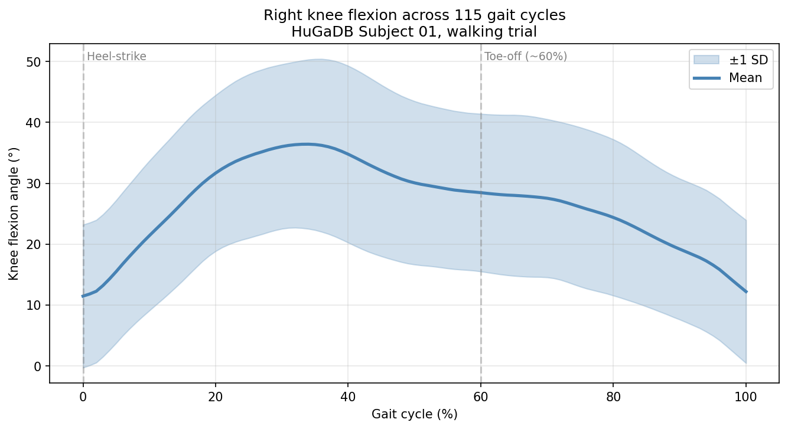

# Knee Flexion Analysis from IMU Data During Walking

A short signal-processing project that estimates right-knee flexion angle through
the gait cycle using inertial measurement unit (IMU) data from a public dataset
(HuGaDB). Built as a personal exploration of biomechanical signal analysis.



## What this does

- Loads raw accelerometer and gyroscope data from the right thigh and right
  shin of a single subject walking (HuGaDB Subject 01, ~106 s trial, fs ≈ 56 Hz).
- Estimates the sagittal-plane pitch of each segment using a **complementary
  filter** (α = 0.98) that blends gyroscope integration with accelerometer-based
  tilt to mitigate gyroscope drift.
- Computes knee flexion as the difference between thigh and shin pitch.
- Baseline-corrects (5th percentile → 0°) and low-pass filters at 10 Hz to
  remove sensor noise above the gait-relevant frequency band.
- Segments the signal into individual gait cycles using local minima of the
  knee angle as approximate heel-strike markers, resamples each cycle to 0–100%
  gait cycle, and averages across 115 cycles to produce the mean ± 1 SD curve.

## Result

Estimated **peak knee flexion of ~36° at ~34% of the gait cycle**, across 115
averaged cycles, with a tight standard-deviation band suggesting stable
within-subject gait.

## Honest limitations

A canonical knee-flexion-vs-gait-cycle curve from optical motion capture shows
two distinct peaks: a small stance-phase peak (~15° around 15% gait cycle) and
a larger swing-phase peak (~60° around 70–75%). This estimate shows a single
broader peak. Several factors likely contribute:

1. **Gait-cycle marker.** I used knee-angle minima as the cycle boundary
   instead of true heel-strike events (which are typically detected from foot
   accelerometer signals or force plates). This can shift the cycle phase and
   smear the swing-phase peak into the broader mid-cycle bump.
2. **IMU alignment.** The complementary filter assumes the gyroscope x-axis
   aligns with the sagittal-plane rotation axis. Real-world sensor placement
   has small misalignments that introduce a baseline offset (visible as the
   ~11.5° floor in this analysis).
3. **Single-axis pitch estimate.** A full segment-orientation estimate would
   use all three gyroscope axes plus a more robust filter (Madgwick or Kalman),
   rather than the 1-axis simplification used here.
4. **Single subject.** Inter-subject variability isn't captured.

## What I'd do next

- Detect heel-strikes from foot-mounted IMU vertical-acceleration peaks rather
  than knee-angle minima.
- Replace the 1-axis complementary filter with a 3-axis Madgwick filter using
  the `ahrs` Python library for full quaternion-based segment orientation.
- Run the same pipeline across all 18 subjects in HuGaDB and report
  inter-subject variability.
- Validate against an optical-motion-capture ground truth dataset (e.g., CMU
  Mocap, or one of the open biomechanics datasets that ship both IMU and
  marker data simultaneously).

## Why I built this

I'm an undergraduate biomedical-engineering student interested in
biomechanics and assistive-device design. This was a weekend project to get
hands-on with IMU-based gait analysis after working on EMG-controlled
exoskeleton hardware as part of the Waterloo Biomechatronics design team. It
is an exploration, not a clinical tool — the limitations above are real and
the result should be read in that light.

## Data

[HuGaDB: Human Gait Database](https://github.com/romanchereshnev/HuGaDB) — an
open multi-sensor IMU + EMG dataset of 18 subjects performing 12 activities.

> Chereshnev, R., & Kertész-Farkas, A. (2017). HuGaDB: Human Gait Database
> for Activity Recognition from Wearable Inertial Sensor Networks.

## Running it

```bash
git clone https://github.com/isaaac-afk/gait-analysis.git
cd gait-analysis
# Open gait_analysis.ipynb in Google Colab or Jupyter
```

Dependencies: `numpy`, `pandas`, `scipy`, `matplotlib` (all standard).

## Tools

Python · NumPy · pandas · SciPy (`signal.butter`, `signal.filtfilt`,
`signal.find_peaks`) · Matplotlib · Google Colab.
